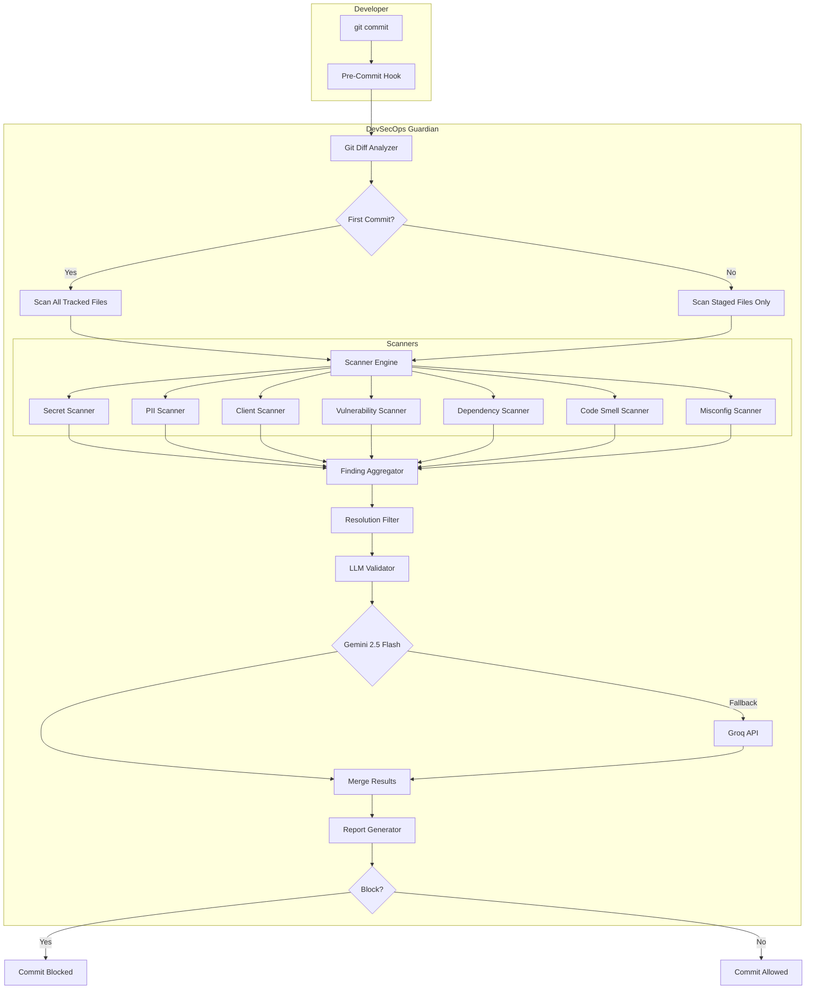

# Architecture

## System Overview



## Component Architecture

```
devsecops/
├── cli/              # Typer CLI commands
├── core/             # Config, git analysis, models, storage
├── scanners/         # Pluggable scanner adapters
├── llm/              # Gemini + Groq validation layer
├── reporting/        # Console, JSON, Markdown reports
├── hooks/            # Git hook installer
└── orchestrator.py   # Main scan coordinator
```

## Data Flow

1. **Git Analysis** — Determines first vs incremental scan; extracts changed line numbers via `git diff --cached -U0`
2. **Parallel Scanning** — ThreadPoolExecutor runs enabled scanners concurrently
3. **Fingerprinting** — SHA256(file + type + line + snippet) for deduplication and resolution tracking
4. **Resolution Filter** — Skips findings in `.devsecops/resolved_issues.json`
5. **LLM Validation** — Sends only ±20 line snippets around each finding (never full files/repos)
6. **Blocking Decision** — Applies severity rules + LLM false-positive filtering
7. **Reporting** — Rich console + JSON + Markdown outputs

## LLM Strategy

```
Scanner Finding → Extract Snippet (±20 lines) → Gemini Validate → Merge
                                                      ↓ (fail)
                                                   Groq Fallback
```

Cost optimization:
- No full-file or full-repo transmission
- Only suspicious snippets sent
- LLM confirms or rejects scanner findings
- Auto-fix suggestions generated on confirmation

## Storage (JSON Only)

```
.devsecops/
├── config.yaml
├── client_patterns.yaml
├── baseline.json           # First-commit snapshot
├── resolved_issues.json    # Fingerprint → resolution
├── scan_history.json       # Last 100 scans
├── last_report.json        # Most recent report
└── reports/                # Timestamped reports
```

## Extensibility

### Adding a Scanner

1. Subclass `BaseScanner` in `scanners/`
2. Implement `scan(context) -> list[Finding]`
3. Register in `scanners/__init__.py`

### Adding an LLM Provider

1. Subclass `LLMProvider` in `llm/providers.py`
2. Implement `validate_finding()`
3. Register in `LLMValidator.__init__`

## Performance

| Optimization | Implementation |
|-------------|----------------|
| Incremental scan | `git diff --cached` line-level filtering |
| Parallel execution | ThreadPoolExecutor (configurable workers) |
| Finding deduplication | Per-scanner dedupe + fingerprint |
| Resolution cache | JSON lookup, no DB overhead |
| LLM snippet-only | ±20 lines per finding |

Target: <10 seconds for incremental scans on large repos.

## Security Boundaries

- API keys loaded from `.env` only
- No secrets logged or persisted in reports (truncated snippets)
- Hook runs locally; no code leaves machine except LLM snippets
- External tools (Gitleaks, Semgrep) run as subprocesses on local files
